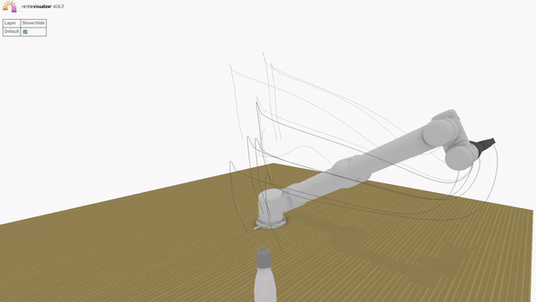

# Robowaiter

This is a robotics project for the `CS5478 - Intelligent Robots` class taught by Lin Shao at NUS.

Project lead by :
- Guilhem Mathieux @guimath
- Louth Bin Rawshan @louth-bin
- Nuran Kasthuriarachchi @nuran

The primary objective of this project is to design a robot capable of assisting with everyday tasks.
Specifically, our team will concentrate on a common activity in daily routines: opening a bottle and
subsequently pouring its contents into a glass.
We aim to create a robotic system with the following capabilities 

1. Grasp the cap and unscrew it
2. Grasp the bottle and move it to a position above the glass
3. Adjust the bottle’s position over the glass and pour without spillage

## Mujoco 

Initially we used the mujoco simulator.

### Installation

All python libraries need to run [MujocoController](MujocoController.py) are in the [requirements](requirements.txt) 
The Mujoco210 binaries need to be installed seperately (see [mujoco-py](https://github.com/openai/mujoco-py) installation)

### Information

We employed baseline control algorithms to direct the arm to specified locations and manage the
gripper’s operations.This involved:
1. Utilizing inverse kinematics to deduce joint values configuration for the desired end effector
pose.
2. Employing PID controllers to navigate each joint from its present q-value towards the goal
q-value.

Utilizing this ability to position the arm at desired locations, we programmed the following procedure:

1. Relocate end-effector within the bottle’s grasping range.
2. Secure the bottle ensuring no slippage.
3. Transport the bottle to a new position while maintaining its upright position
4. Tip it over

## NimblePhysics

To improve our motion planning algorithm, we moved on the differentiable simulator Nimblephysics.

### Installation 

The [NimbleController](NimbleController.py) requires pytorch and nimblephysics (the [original nimblephysics](https://github.com/keenon/nimblephysics) library should be enough to run the code, but we recommend installing the [Jade/Adamas fork](https://github.com/LapUtopia/Adamas/tree/vanilla) as this is what we used and it provides better collision detection)

### Information 

This change of simulator allowed for much more in depth motion planning and open the door to a lot of new possibilities. 

Here is a list of all actions done :

- Move the arm just above the cap

- Uncap the bottle

- Grasp the bottle

- Move the bottle and pour its contents

For much more detailed information see the [project report](final_report.pdf)